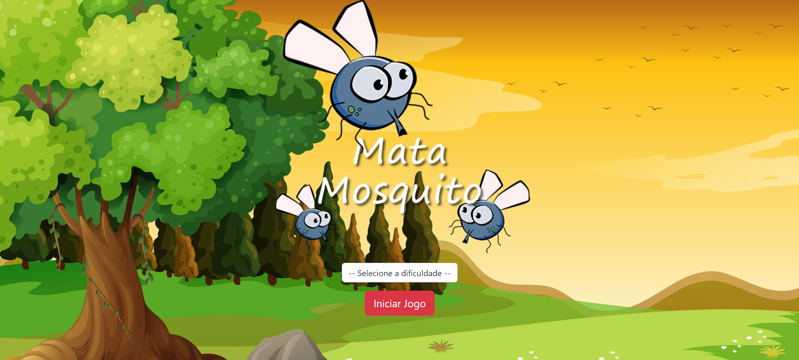
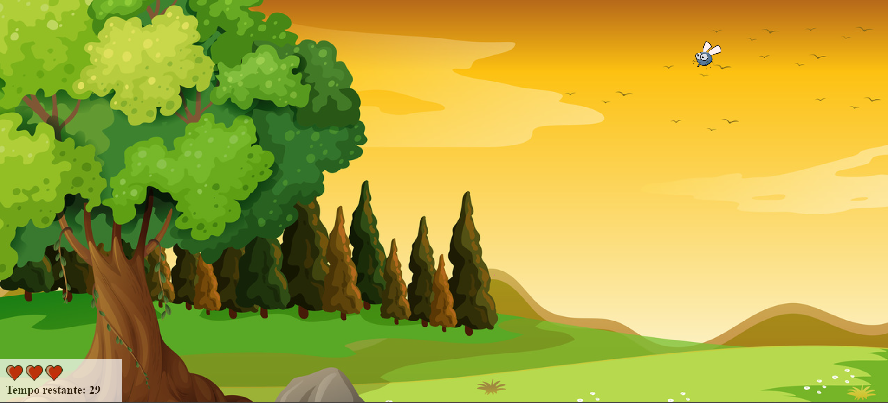
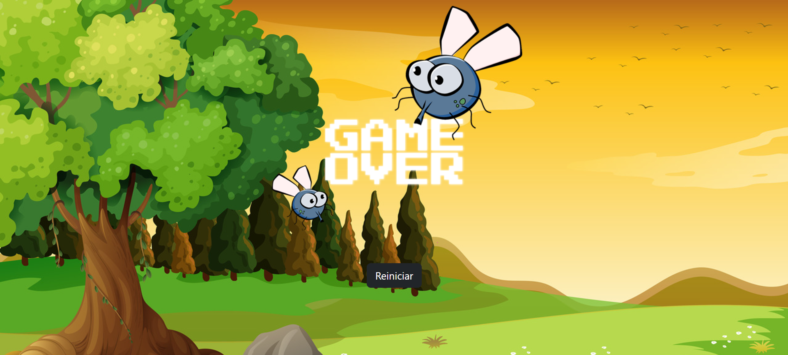

# Mata Mosquito

- Este projeto foi desenvolvido seguindo o curso do Jorge Sant Ana e Jamilton Damasceno.
  
## Descrição

O Mata Mosquito é um mini game onde o objetivo é eliminar mosquitos clicando com o mouse. 
O jogo oferece três níveis de dificuldade: Normal, Difícil e Super Difícil. 
O jogador começa com 3 vidas e deve sobreviver por 30 segundos, matando os mosquitos sem perder todas as vidas para vencer.

## Tecnologias Utilizadas

- **HTML**: Estruturação das páginas.
- **CSS**: Estilização do jogo.
- **JavaScript**: Lógica do jogo e interação com o usuário.
- **Bootstrap**: Utilizado para o design responsivo e estilização rápida.

## Imagens

### Tela Inicial

### Tela do Jogo

### Tela de Vitória

### Tela de Derrota

